# FIDES

[Web site](https://erasmusdev.gluu.org/fides) 

## 1. Introduction
FIDES Web application responsible for managing organization and their openid providers. The organization admin can registered into the FIDES application and take facility of badges. The Federation admin can manage all the organization which is registered into the FIDES and provide the badge templates for organization admin.

## 2. Technologies
- Server Side Technologies
    1. Node JS: Create server and apis endpoint
    2. Mongodb: Database for store data
    3. SCIM Node: Used to dynamic registration of user into gluu server 	 	
    4. OXD Node: The oxd server supports the OpenID Connect and UMA profiles of OAuth 	2.0. OpenID Connect can be used to send a user for authentication 	and gather 	identity information about the user. UMA can be used to 	manage what digital 	resources the user should have access to.
	
    	
- Client Side Technologies
    1. Angular JS
    
## 3. Flow of Application
### 3.1 User (Organization admin) registration

- In this stage following things is happens
    1. User(Organization admin) registered into FIDES as well as in gluu server.
    2. Registered Organization (Note: According to otto meeting organization may also 		called as participant).
    3. Registered Provider (Entity).
 
In registration FIDES used UMA protocol for registered user into gluu server using scim node client.
UMA: https://docs.kantarainitiative.org/uma/rec-uma-core.html

Below is WEB UI for User registration
1. Person Email
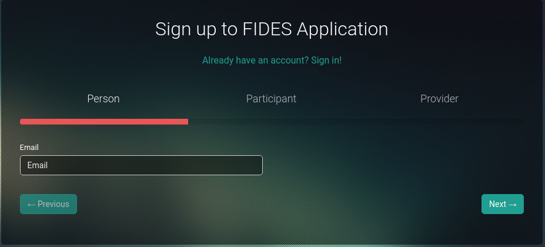
2. Organization Details
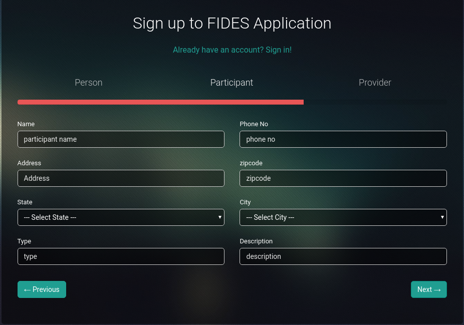
3. Provider URL
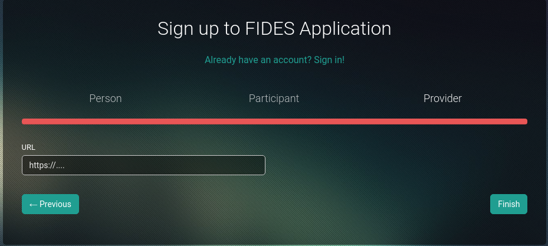

## 3.2 Login
- FIDES use OXD Server for used to send a user for authentication and gather identity information about the user. The oxd server supports the OpenID Connect and UMA profiles of OAuth 2.0. Here admin and user both can use same login.
1. Login

## 3.3 Added Federation
- Federation admin added new federation.
1. List and Add Federation
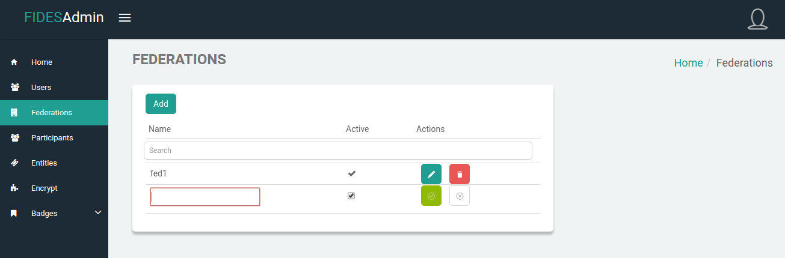

## 3.4 Approved Organization
- Federation admin approve the newly registered organization. Federation admin can also see all the users, organization and providers.
1. List and Approve Organization
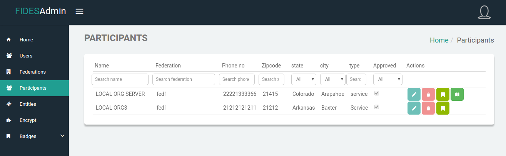

## 3.5 Create Badge template
- Federation admin create badge template for organization admin.
1. Create Badge Template
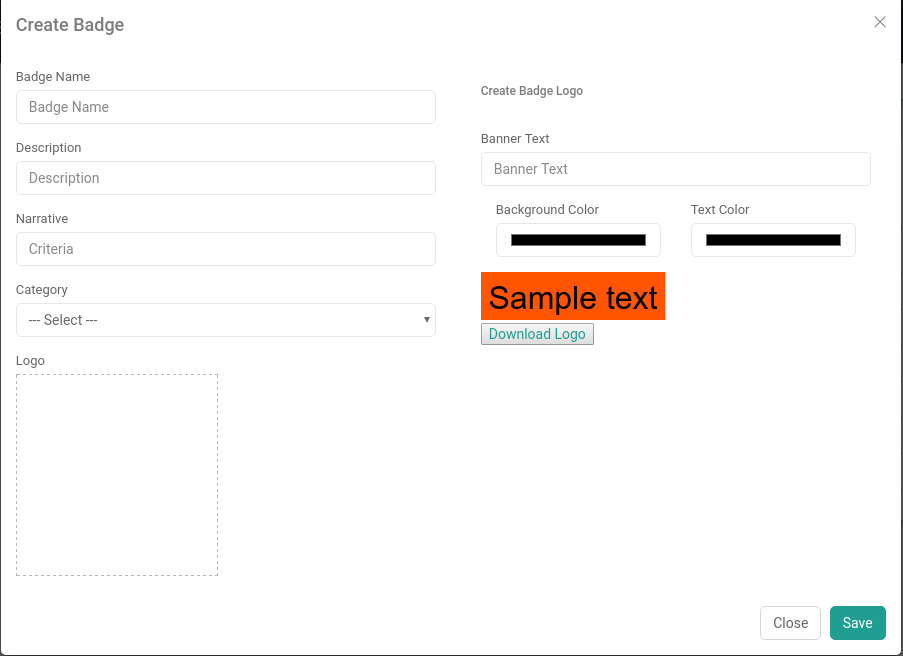

## 3.6 Request for Badge Template
- Organization admin request for the badge templates.
1. Badge Request Status
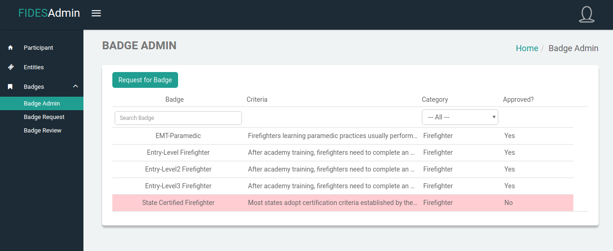
2. Badge Request By Organization admin
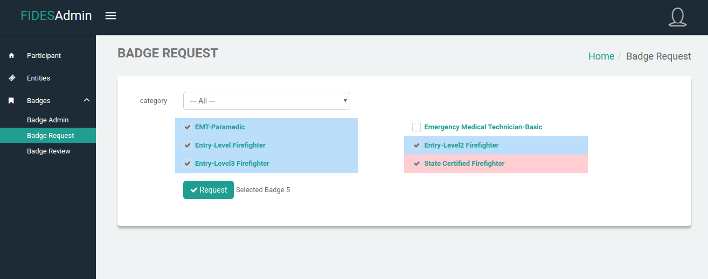

## 3.7 Approved Badge Request
- Federation admin approve the badge, which is request by organization admin.
1. Requested Badges List
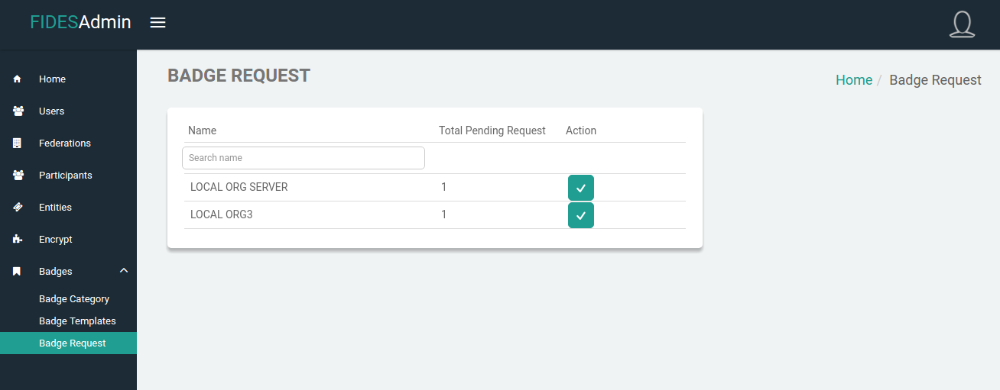
2. Approve Badges
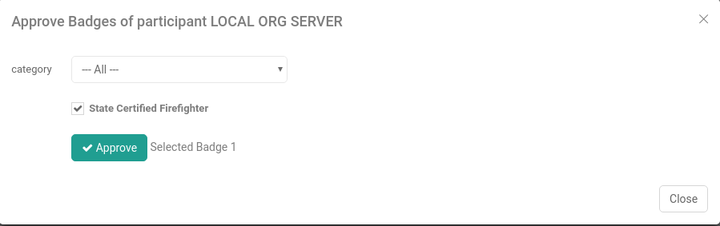

## 3.8 Badge Review
- Organization admin see all the approved and pending badges which is requested by mobile users who request for actual badges. FIDES call the badge manager apis for fetch all the pending and approved badges. In Pending badge list, their is approved option and Federation admin can approve the particular actual badge request. Federation admin can also see the actual badge until access is granted by badge manager.
1. Approved Badge List
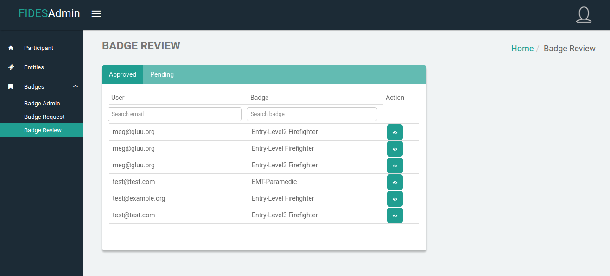
2. Pending Badge List
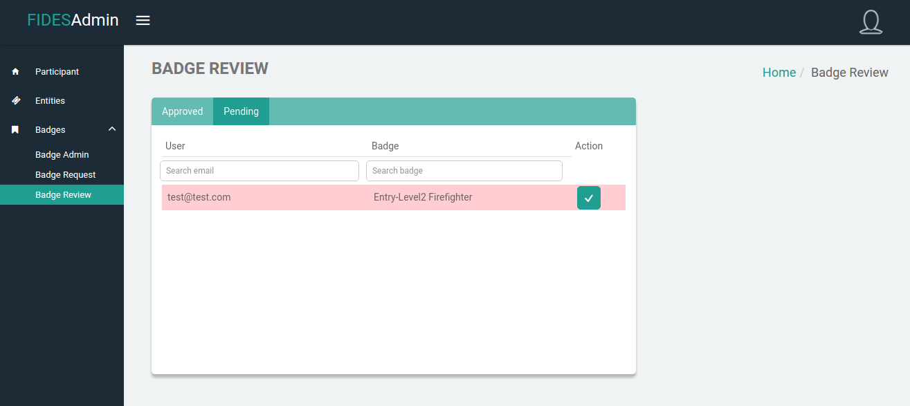
3. Badge Information
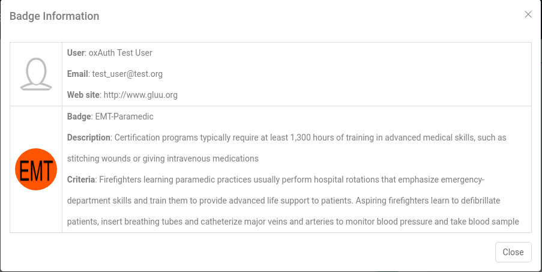