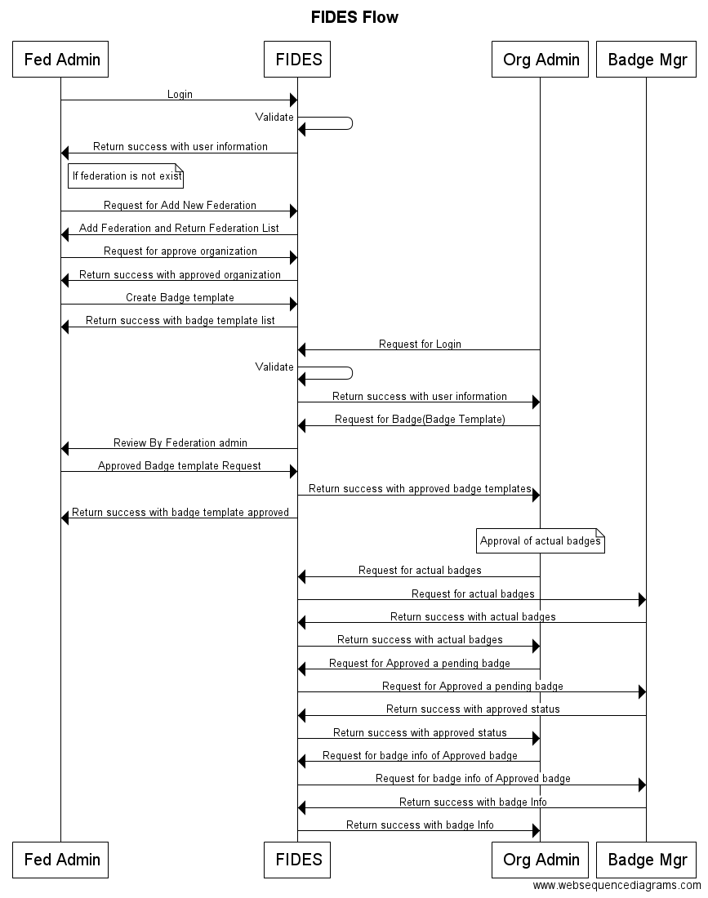
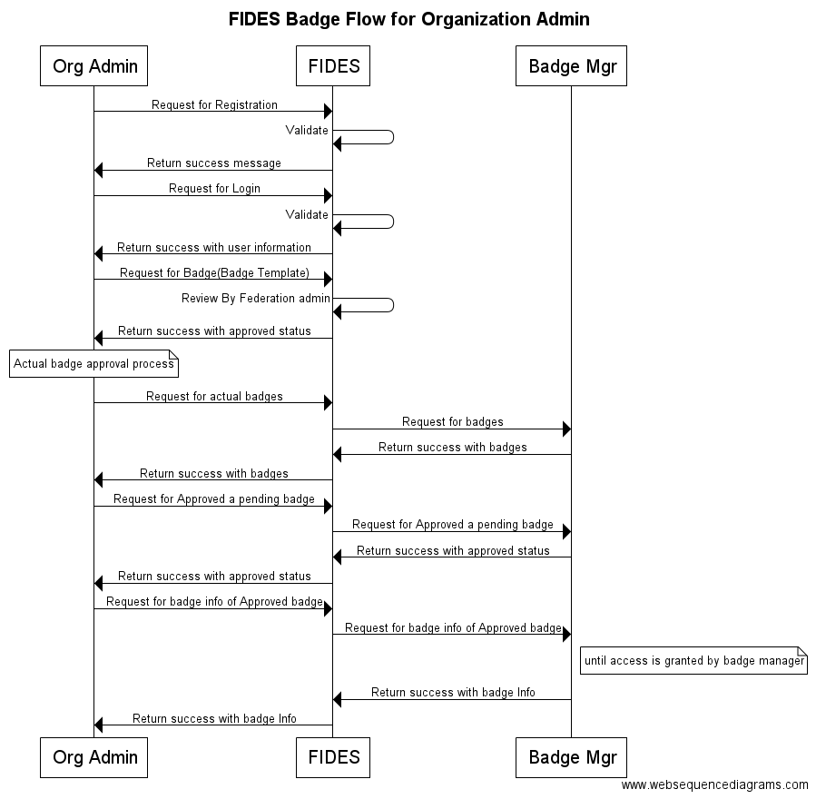

# FIDES

[Web site](https://erasmusdev.gluu.org/fides) 

## 1. Overview
FIDES Web application responsible for managing organization and their openid providers. The organization admin can registered into the FIDES application and take facility of badges. The Federation admin can manage all the organization which is registered into the FIDES and provide the badge templates for organization admin.

- Federation: A group of autonomous organizations that agree to abide the authority of a central organization to reduce the cost of collaboration.
[Federation Schema model](https://github.com/GluuFederation/erasmus/blob/master/FIDES/FidesIdentityAPI/models/federation.js)

- Participant: An organization that registers with a Registration Authority for the purpose of joining a Federation.
[Participant Schema model](https://github.com/GluuFederation/erasmus/blob/master/FIDES/FidesIdentityAPI/models/participant.js)

- Entity: A techincal service operated by a Particpant, such as an identity provider.
[Entity Schema model](https://github.com/GluuFederation/erasmus/blob/master/FIDES/FidesIdentityAPI/models/entity.js)

## 2. Installation and Deploy
   1. [Node js](https://nodejs.org/)
   2. [Mongo DB](https://docs.mongodb.com/manual/installation/)
   3. [Gluu Server](https://gluu.org/docs/ce/3.0.1/installation-guide/install/)
   4. [OXD Server](https://gluu.org/docs/oxd/install/)
   5. Clone repository [ERASMUS](https://github.com/GluuFederation/erasmus)
   6. Start FIDES API
   
   - For Start API go to erasmus/FIDES/FidesIdentityAPI
   - Install node package. 
   
    $ npm install
    
   - Start Node API. You can change port by changing base URL in .env-dev file.
    
    $ gulp
   
   - For Start Web project go to erasmus/FIDES/FidesWebApplication
   - Install node package. 
      
    $ npm install
       
   - Start Web project. You can change API endpoints by urls in src/app/app.js file.
       
    $ gulp serve    

   1. For deploy Node API, you can use [pm2](http://pm2.keymetrics.io/docs/usage/quick-start/) package.
      If you want to run api on https then, you need to yous https package for that.
    
    var express = require('express'),
    app = express(),
    https = require('https'),
    fs = require('fs');
    
    var options = {
      key: fs.readFileSync('privkey.pem'),
      cert: fs.readFileSync('cert.pem')
    };
   
    // Create an HTTPS service.
    https.createServer(options, app).listen(process.env.PORT, () => {
        // Console.log('Server started successfully');
    });
    
   2. For Angular Project deployment, you need to build project using gulp build task
   
    gulp build
    
   This above command gulp all the files and make release folder.
   You just need to deploy this release folder on server (example: In apache, /var/www/html directory).
    
## 3. Flow of Application

1. FIDES Sequence diagram

2. FIDES Federation admin Sequence diagram

3. FIDES Organization admin Sequence diagram

 
### 3.1 User (Organization admin) registration

- In this stage following things is happens
    1. User(Organization admin) registered into FIDES as well as in gluu server.
    2. Registered Organization (Note: According to otto meeting organization may also 		called as participant).
    3. Registered Provider (Entity).
 
In registration FIDES used UMA protocol for registered user into gluu server using scim node client.
UMA: https://docs.kantarainitiative.org/uma/rec-uma-core.html

Below is WEB UI for User registration
1. Person Email

2. Organization Details

3. Provider URL

## 3.2 Login
- FIDES use OXD Server for used to send a user for authentication and gather identity information about the user. The oxd server supports the OpenID Connect and UMA profiles of OAuth 2.0. Here admin and user both can use same login.
1. Login

## 3.3 Added Federation
- Federation admin added new federation.
1. List and Add Federation

## 3.4 Approved Organization
- Federation admin approve the newly registered organization. Federation admin can also see all the users, organization and providers.
1. List and Approve Organization

## 3.5 Create Badge template
- Federation admin create badge template for organization admin.
1. Create Badge Template

## 3.6 Request for Badge Template
- Organization admin request for the badge templates.
1. Badge Request Status

2. Badge Request By Organization admin

## 3.7 Approved Badge Request
- Federation admin approve the badge, which is request by organization admin.
1. Requested Badges List

2. Approve Badges

## 3.8 Badge Review
- Organization admin see all the approved and pending badges which is requested by mobile users who request for actual badges. FIDES call the badge manager apis for fetch all the pending and approved badges. In Pending badge list, their is approved option and Federation admin can approve the particular actual badge request. Federation admin can also see the actual badge until access is granted by badge manager.
1. Approved Badge List

2. Pending Badge List

3. Badge Information
