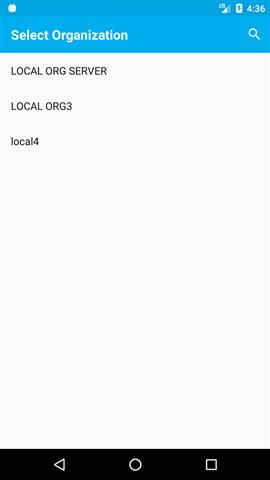

# Overview

Erasmus-Id mobile app is built to demonstrate the working of ERASMUS.

This app has pretty straight forward flow and easy to use for the user.

It will provide functionality to the user both Present and Validate the 
badge in very effective and fast way.

Any user can become presenter or validator in a single app with just click 
of a button.

Mobile app directly communicates with Badge Manager API.

Let's take a look and understand the flow of this useful application.

### Splash Screen
As soon as app get launched, it will show this splash screen for a while.

In a few seconds it will redirect to the next screen of the app

### States and Cities listing
All States and Cities of USA are displayed in this screen

User can change state from the spinner and cities of that state will be 
populated in the list which user can tap on and navigate to next screen.

### Participants listing
Based on the state and city selected in previous screen, Participants will be 
displayed which are retrieved from badge mgr API.

Badge mgr API will retrieve participants from FIDES and returns participants
list to mobile app.

### Login
User can select participant which will redirect to Login screen.

`Login` button in this screen will authenticate the user.
 
`Change Organization` link at the bottom of the screen will allow user to 
navigate back to the participant list and change participant.

### Authentication
On Click of `Login` button, user will be redirected to oxAuth login screen 
in browser based on the selected participant's opHost and user will be 
authenticated to oxAuth using app auth and redirected back to app after 
successful authentication.

### U2F registration and authentication
After successful authentication, user will be redirected to this screen 
which will perform U2F registration and authentication.

First, user registration will be performed and if user is already registered 
with U2F then authentication will be done.

After successful completion of this process by clicking `Approve` or `Decline` 
button, user will be redirected to Badge status screen.

### Badge Status
All `Approved` and `Pending` badge requests will be displayed in this screen.

User can perform following operations in this screen.

1.Toggle privacy(Private/Public) of approved badge.

2.Delete badge request.

3.Request badge.
 
- On tap of the approved badge request, badge qr code will be generated and 
returns basic badge info along with qr code image url.

4. Make new badge request

- +(plus) icon at the top right corner allows user to see template badges 
from where user can make new badge request.

5. Validate badge

- `Validate` button at the bottom of this screen will open scanner where 
user can scan and validate badge qr code. 

### Template Badges
This screen will display all the template badges from which user can tap 
and make new request. 

Badge Mgr API returns template badges retrieving from FIDES based on the
selected participant.

After successful badge request, user will be redirected to badge status 
screen where he/she can see newly requested pending badge.

### Badge Verification
Any user can become `Validator` in app by just clicking the `Validate`
button at the bottom of the badge status screen.

It will open scanner using which user can scan the barcode.

- As soon as `Validator` scan qr code, It will notify `Asserter` that 
someone want to see your badge. It will show popup with `Allow` and `Deny`
options.
- `Asserter` can set permission and based on the action from `Asserter`,
`Validator` will be notified and validation process will continue.
- If `Asserter` allows to see badge then only validator can see and 
verify badge. In case of denial from `Asserter`, `Validator` will not be 
able to see the badge.
- As soon as badge get verified successfully, `Asserter` will be notified
that his/her badge verified successfully.

This entire process will get completed within 90 seconds as temporary link
for badge verification will get expires after 90 seconds.

Verification success screen will be as follow:

In case of badge verification failure, `Validator` will be redirected to 
following failure screen.

